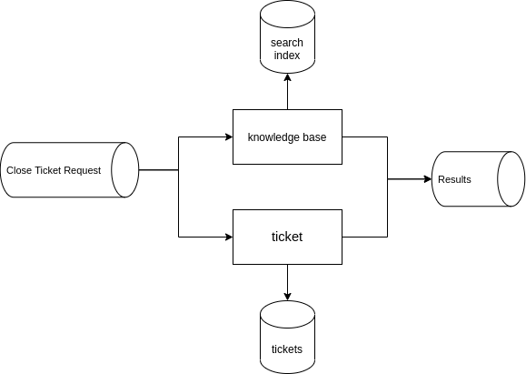

# Closing tickets

## Context and Problem Statement
Two main components come in play when closing a ticket <i>Ticket Component</i> and <i>Knowledge Base Component</i> which complicate things when it comes to synchronizing transactions between them.

## Considered Options
* Only take the success and failure of the <i>ticket component</i> in consideration 
* Implement choreography Saga
* Chain the events ( save Data in one component and then the other )

## Decision Outcome
* We decided to Only take the success and failure of the <i>ticket component</i> in consideration
* If <i>ticket component</i> failed the transaction is considered failed
* If <i>ticket component</i> succeed but the <i>Knowledge Base component</i> fails, <i>Knowledge Base component</i> will keep retrying. Only reasons that can prevent an event from being saved to  <i>Knowledge Base component</i> are technical ones that should be solved with retries.

### Positive Consequences
* Simpler to implement
* Better performances
